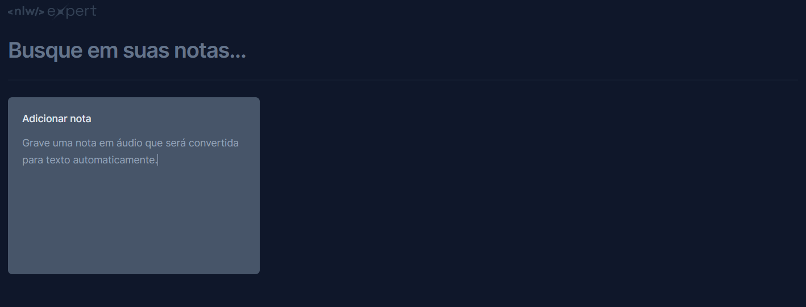
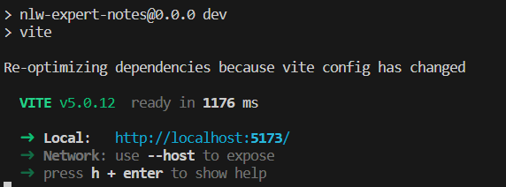

<h1 align="center">
    
</h1>


# 🏁 Block-Notes
<p align="center"> O Projeto <strong>Block Notes</strong> é uma plataforma digital desenvolvida com o objetivo de facilitar a vida de pessoas que precisam fazer anotações rápidas e organizadas. Seja para estudantes que precisam de um local para anotar pontos importantes de uma aula, profissionais que precisam registrar ideias durante uma reunião, ou qualquer pessoa que simplesmente queira um local para guardar pensamentos e ideias, o <strong>Block Notes</strong> está aqui para ajudar.</p>

<h1 align="center">
    <a href="https://pt-br.react.dev">🔗 React</a>
    <br>
      
</h1>


<p align="center">🚀 lib's para construir interfaces do usuário com componentes reutilizáveis: 
</p>

<div align="center">


</div>


# ☑ Tabela de conteúdos

- [🏁 Block-Notes](#-block-notes)
- [☑ Tabela de conteúdos](#-tabela-de-conteúdos)
- [🥳Como usar](#como-usar)
    - [🛠 Pré-requisitos](#-pré-requisitos)
- [🛠 Tecnologias](#-tecnologias)
- [Conclusão](#conclusão)


# 🥳Como usar


 ### 🛠 Pré-requisitos

Antes de começar, você vai precisar ter instalado em sua máquina as seguintes ferramentas:
[Git](https://git-scm.com), [Node.js](https://nodejs.org/en/). 

Além disto é bom ter um editor para trabalhar com o código como [VSCode](https://code.visualstudio.com/)

```bash
# Clone este repositório
$ git clone https://github.com/DevMatheusBarba/Block-Notes.git

# Acesse a pasta do projeto no terminal/cmd
$ cd block-notes

# Instale as dependências
$ npm install

# Execute a aplicação em modo de desenvolvimento
$ npm run dev

# O servidor inciará na porta:5173 - acesse <http://localhost:5173>

```

> ### Você deve ver algo no seu terminal similar á imagem abaixo. 
> <p align="center">  </p>


# 🛠 Tecnologias

As seguintes ferramentas foram usadas na construção do projeto:


- 
- 
- 
- 


# Conclusão

Estou orgulhoso de apresentar o Projeto Block Notes, um resultado direto do no envolvimento no bootcamp NLW Expert oferecido pela [Rocketseat](https://www.rocketseat.com.br/).

Durante este intenso bootcamp, tivemos a oportunidade de aprofundar nossos conhecimentos em várias tecnologias de ponta e aplicá-los na criação deste projeto. O Block Notes é uma plataforma de anotações online que incorpora os princípios de design e desenvolvimento que foram o foco do bootcamp.

Agradeço à [Rocketseat](https://www.rocketseat.com.br/). por fornecer uma experiência de aprendizado tão enriquecedora e estou animados para aplicar as habilidades que adquiri para continuar melhorando o Block Notes e futuros projetos.

Obrigado por seu apoio contínuo e espero que você aproveite o uso do Block Notes tanto quanto eu gostei de construí-lo!

<h4 align="center"> 
	🚧  Block Notes 🚀 Concluido  🚧
</h4>